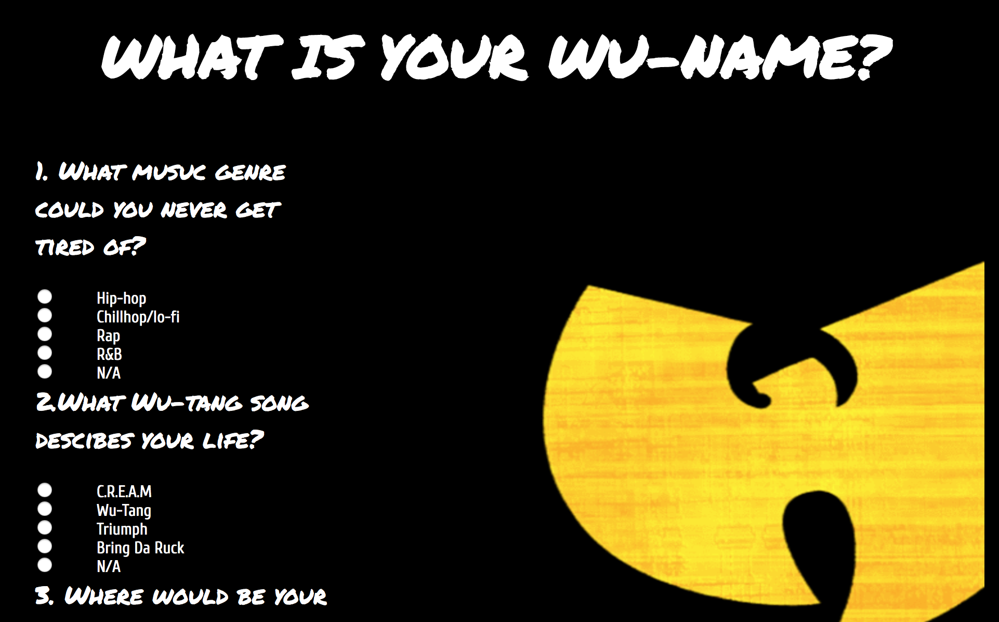

# Wu-tang Name Generator
This application is a survey that asks 5 questions for the user to answer. Ba generator will return their name based on their answer.

## How it's made:
**Tech Used** I used HTML, CSS and JavaScript and Node.js to build this application.

## Lesson Learned
Learned  about the form submit request and how to get user data in Javascript from the DOM. 
