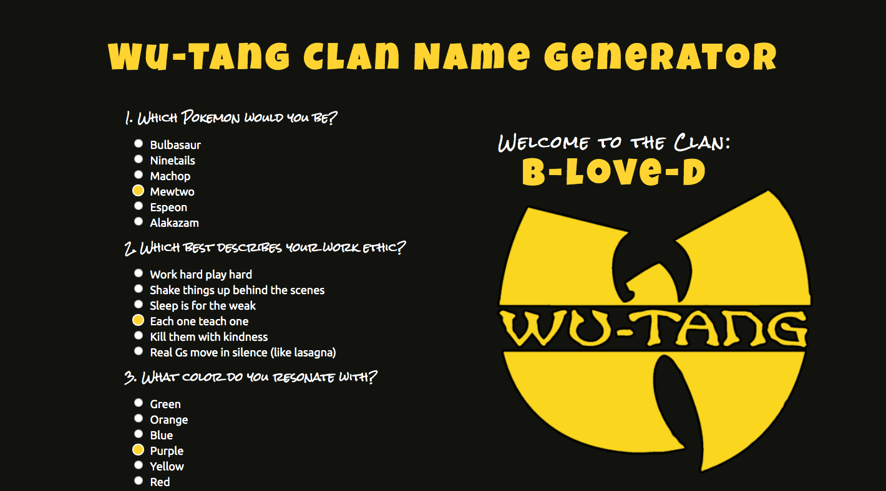

# 🎤  Wu-Tang Name Generator

### Goal: Create a Wu-Tang Clan name generator. Present the user with 5 survey questions and based on those answers randomly generate their name.

**View project in browser:** https://endev-wutangnamegenerator.netlify.com

## Design and Development:
**Tech Used** HTML, CSS, JavaScript:
Based on if users selected mostly options A, B, C, D, or E- they would get their corresponding names. If they scored equally between any values, the first alphabetical letter is chosen.

## Reflections:
I really enjoyed building a name generator / survey because it's used a lot by popular sites and apps. It was fun to dig into the logic behind them and create my own! 
