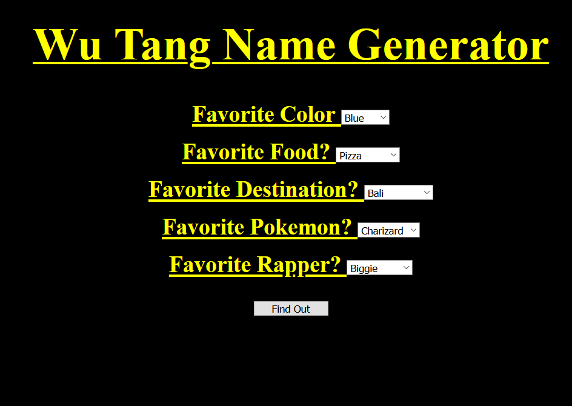

# 🎤 Week08 Bootcamp2019a Project: Wu-Tang Name Generator
link: https://brave-newton-8294eb.netlify.com/
### Goal: Create a Wu-Tang Clan name generator. Present the user with 5 survey questions and based on those answers randomly generate their name. The name doesn't have to be exact names, but Wu-Tang sounding-ish names. Ex: Childish Gambino (who actually got his name from a Wu-Tang name generator).

### How I did it:

- I set up a server that will recieve requests for HTML, CSS, and JS pages and will send them out.
- The html page will load five select tags that each have 3 options
- A button is present than when clicked will trigger an event listener, the listener has a callback function that will take the numeric values of the chosen answers and add them together.
- The mimumum answer total is 5 and the maximum is 15, the number of possible responses is 6 so 4 responses were given a 2 sum range and 2 were given a one sum range
