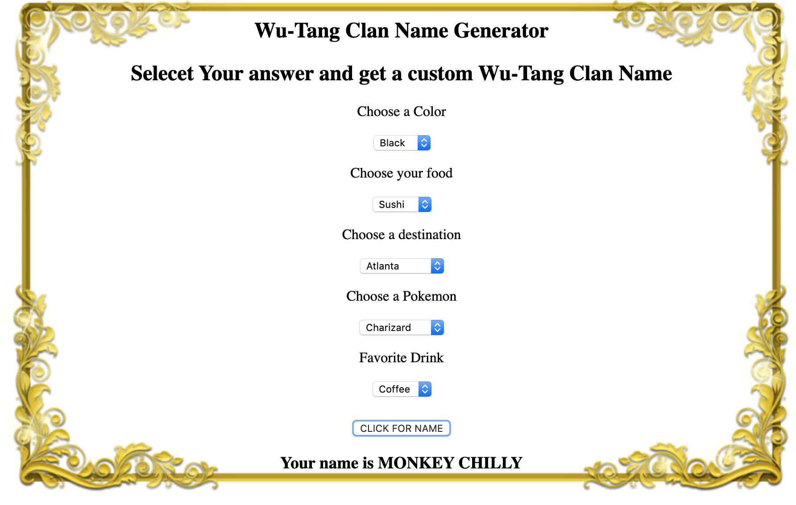

# 🎤 Project: Wu-Tang Name Generator

### Goal: I created a Wu-Tang Clan name generator. That presents the user with 5 survey questions and based on those answers will generate their name.  This application is built also using NODE.js.  In order to make this application also to be able to run server side.

Tech Used:
- HTML5
- CSS
- Javascript
- NODE.js

To Run on Your Machine:
- Fork Repo
- Clone Repo to your Machine
- NPM instal figlet  
- Run NODE server.js
- Navigate to localhost:8000
