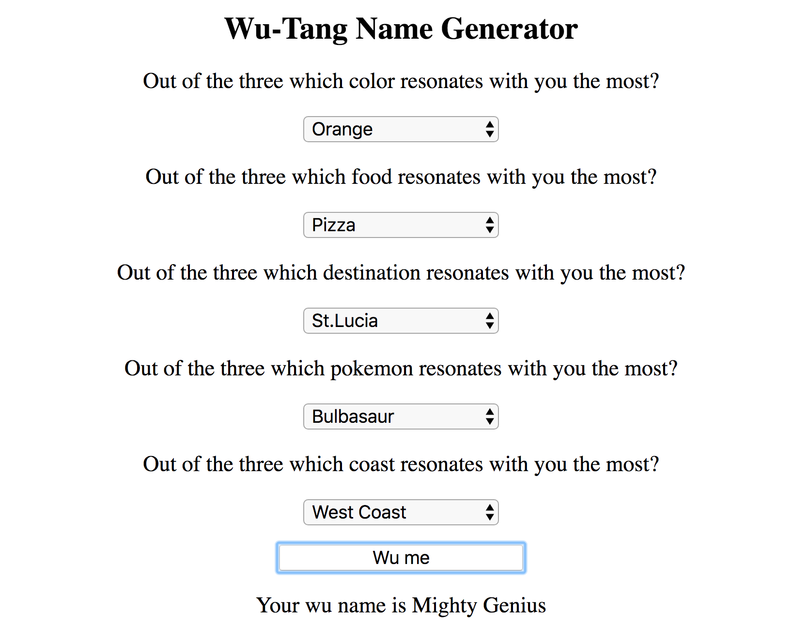

# 🎤 Project: Wu-Tang Name Generator

### Goal: Create a Wu-Tang Clan name generator. Present the user with 5 survey questions and based on those answers randomly generate their name. The name doesn't have to be exact names, but Wu-Tang sounding-ish names. Ex: Childish Gambino (who actually got his name from a Wu-Tang name generator).

* **Project Title: Wu Tang Name Generator**
  - This webpage gives you a wu tang name, based on the way you answer the questions.

* **Image of project in use**

* **Getting Started**
  - Fork this repo
  - type "npm start" into your terminal and enjoy :)
