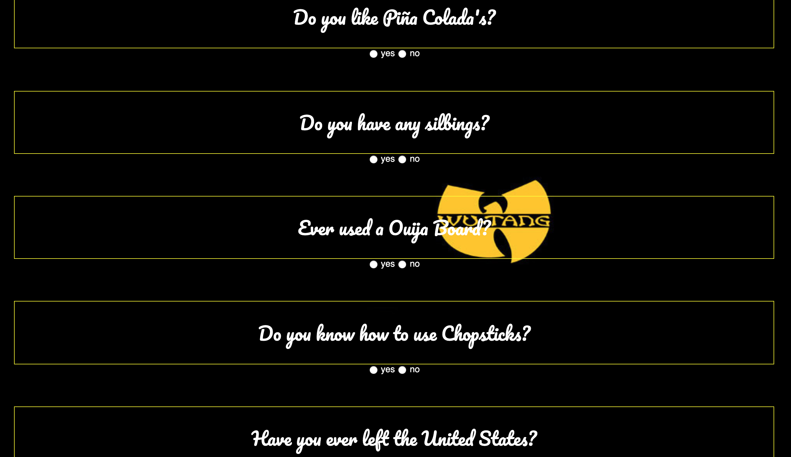

# Wu-Tang Clan name generator
We create a Wu-Tang Clan name generator. We presented the user with 5 survey questions and based on those answers randomly generate their name. Ex: Childish Gambino (who actually got his name from a Wu-Tang name generator).

Our group had a fun time w/ this project. I think because we were enjoying ourselves, we're able to come up with a good strategy to tackle on this application. We decided to just focus on the amount of yes(es) the user chooses to determine the generated name.

## How It's Made:

**Tech used:** HTML, CSS, JavaScript
