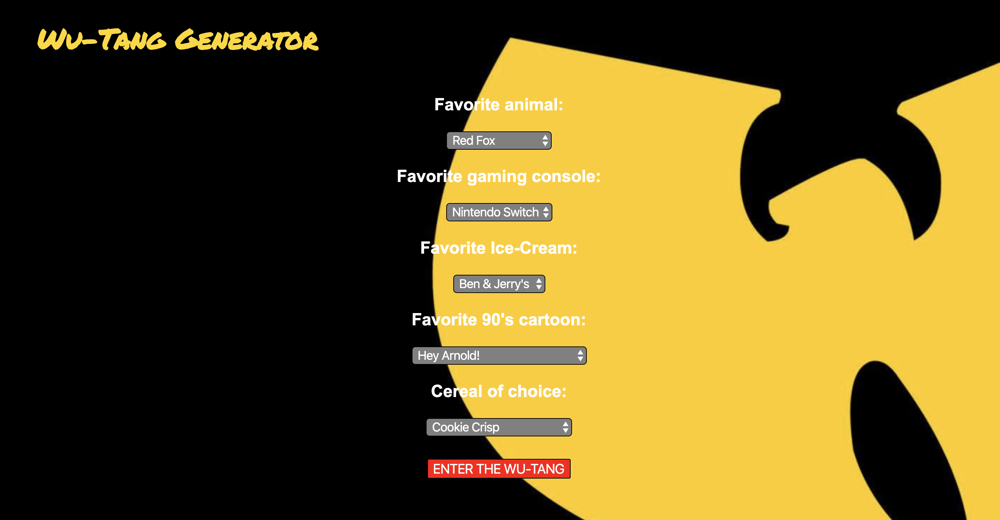

# Wu-Tang Generator 
#### Project Scope: The user selects their favorite options from the five different inputs. Each option contains a unique value that is added in a back end server. The sum equates to an index for arrays containing first and last Wu-Tang names. 
#### View here: https://svdev-cardmatch.netlify.com

# How it was made:
#### HTML5, CSS3, Javascript E6, API, JSON, Node.js

# Optimizations:
#### Back end server created with Node.js to store values and objects that allowed the transference of data between client and server side.   

# Lesson Learned: 
#### I used the value attribute in HTML in conjunction with both Javascript and Node.js to produce values in the server that feed into an index to choose the users Wu-Tang name. By writing a fetch request in the main.js, I was able to carry over data to the server to pin point the correct name in the index and send them back to the front end using the object properties.
