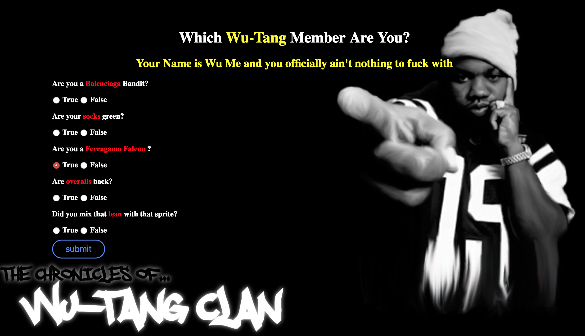

# 🎤 Wu-Tang Name Generator

### Goal: Create a Wu-Tang Clan name generator. Present the user with 5 survey questions and based on those answers randomly generate their name. The name doesn't have to be exact names, but Wu-Tang sounding-ish names. Ex: Childish Gambino (who actually got his name from a Wu-Tang name generator).

 
# Made with:
#### HTML5, CSS3, Javascript, API, JSON, Node.js

Learned how to submit a request that would then return user data and display that in the DOM
