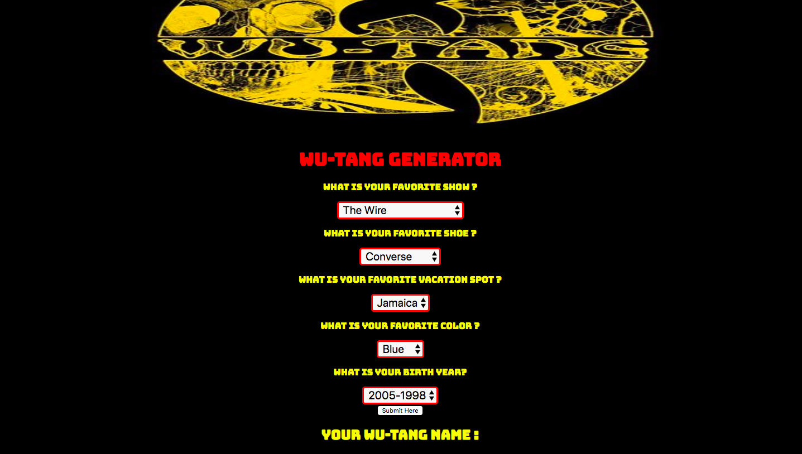

# 🎤 Wu-Tang Name Generator

### Goal: Create a Wu-Tang Clan name generator. Present the user with 5 survey questions and based on those answers randomly generate their name. The name doesn't have to be exact names, but Wu-Tang sounding-ish names. Ex: Childish Gambino (who actually got his name from a Wu-Tang name generator).

I completed the challenge: 5
I feel good about my code: 4

## Tech used: Node.js,CSS, Javascript,html

## Lessons learned:
learned how to work with Node.js
