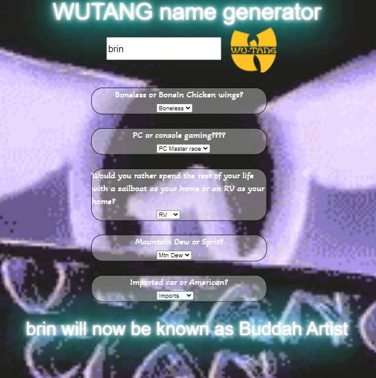

#  Project: Wu-Tang name generator

### Goal: Create a Wu-tang name generator with a series of questions and use that data in order to determine the users name.

This Name generator allows a user to input a they're name and are asked a series of 5 questions to determine their new Wu-Tang name. After the test is filled out the user will press the Wu-Tang icon to retrieve their new name. 

# What I used:
-HTML
-CSS
-JAVASCRIPT
-NODE.JS

 
