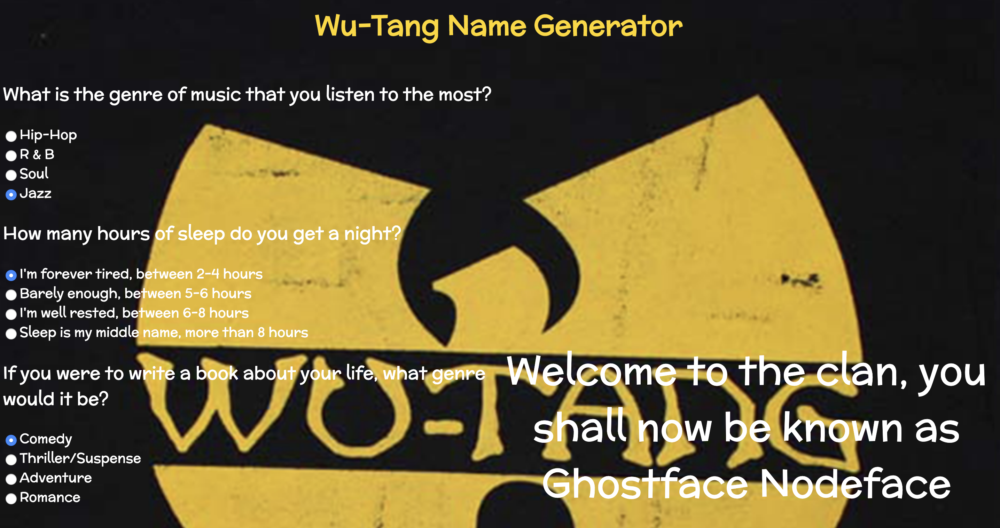

# 🎤 Week 08 Project: Wu-Tang Name Generator

Live Code: 

# How It's Made:
### Tech used: 
HTML, CSS, JS, and Node. Create a Wu-Tang name generator with 5 questions tailored to give the user an unique name. 

# Lessons Learned:
HTML forms and their value attribute data can be fetch through the server side of JavaScript. Was able to see how the html, app.js and server.js moved the data from the arrays and how they would become displayed in the DOM.

# Examples:

Take a look at these couple examples that I have in my own portfolio:

Matching Game: https://github.com/Kim-Flores/matching-card-bootcamp/tree/answer

Palindrome Checker: https://github.com/Kim-Flores/node-palindrome-bootcamp/tree/answer

Coin Flip: https://github.com/Kim-Flores/node-coin-flip-bootcamp/tree/answer

